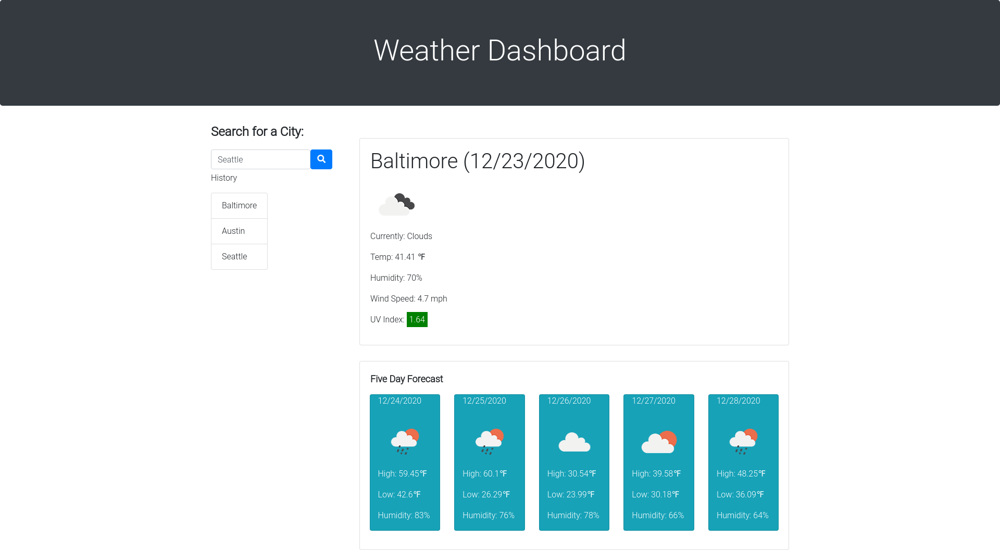

# weather-app
This program is a weather application utilizing RESTful APIs.

[Project Links]

Deployed application: https://balokdecoy.github.io/weather-app/

Github repo: https://github.com/balokdecoy/weather-app

[Project Screenshots]

;

[User Instructions and Program Logic]

Project is a dynamically updating weather application using the OpenWeather API and dayJS API. 

On opening the application, user is shown the current weather and 5 day forecast for the last searched city, if the user has used the program before.

Application contains a search box labeled: Search for a City.

User may enter a city name in the search box and click the search button to display weather data and five day forecast.

If user clicks the search button without entering a city name, an alert will tell them to enter a city name.

Current weather forecast info includes: 
1. City name
2. Date
3. Current conditions
4. Temperature
5. Humidity
6. Wind speed
7. UV Index

UV Index figure is color-coded according to EPA UV Index Guidelines. 

Five Day forecast displays in cards beneath the current weather box. 

When user searches for a city, the city is stored in local storage. This allows the user to reload the page with the last searched city's weather data displayed by default. 

User searches also create a history list on the left side of the screen. This list of past searches is interactive: user can click on the name of a previously searched city to see that city's weather data. 

[Acknowledgments]

This program uses the OpenWeather API to gather weather data. Visit OpenWeather at: https://github.com/balokdecoy/weather-app

This program uses the dayJS API to gather dynamically updating date info. Visit dayJS at: https://day.js.org/en/

UV index figures are color-coded according to the EPA UV Index Scale, which can be found here: https://www.epa.gov/sunsafety/uv-index-scale-0 

Thanks to Amir Ashtiany, Young Ji Kim, Frankie Rosado, and Rachel Wanke for their feedback, support, and brainstorming. Visit their Github pages here:

1. Amir Ashtiany - https://github.com/Alexfit4
2. Young Ji Kim - https://github.com/youjmi
3. Frankie Rosado - https://github.com/Franciscorosado09
4. Rachel Wanke: - https://github.com/rwanke14 